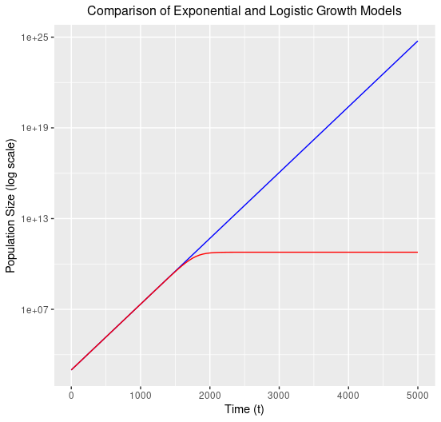

# Logistic Growth:

# Question 1:

# Introduction

This analysis studies the growth dynamics of a bacterial population of *Escherichia coli* over time using data from "experiment.csv". This dataset contains population size (N) measurements at 60-unit time intervals *(t)*. The overarching goal of this study is to model population growth and estimate the parameters of the logistic growth equation characteristic of bacteria. These parameters are growth rate *(r)*, carrying capacity *(k)* and initial population size *(N0)*.

# Methods:

### Part I: Plots

This first script, "**plot_data.R,**" analyses a dataset from "experiment.csv," which contains measurements of a bacterial population's growth over time.

After installing ggplot2, I created a graph of the raw population data (*FIG 1*), with time on the X-axis and population size on the Y. The points formed an S shape, characteristic of logistic growth.

Secondly, I created a semi-log plot (*FIG 2*) where population size (Y axis) was log-transformed. The resulting graph shows two clear phases. The first is linear with an increasing slope. This then turns into a horizontal asymptote which represents the carrying capacity.

#### Script 1: Plots

```{r}
#Script to plot the logistic growth data

growth_data <- read.csv("experiment.csv") #this reads data from experiment.csv

install.packages("ggplot2") #install package needed for creating plots
library(ggplot2)

#Population size as a function of time 
ggplot(aes(t,N), data = growth_data) + #create graph with time on X axis and population size on Y axis
  
  geom_point() + 
  
  xlab("t") + 
  
  ylab("y") + 
  
  theme_bw() 

#Same data but with a log-transformed Y axis
ggplot(aes(t,log(N)), data = growth_data) +
  
  geom_point() +
  
  xlab("t") +
  
  ylab("y") +
  
  scale_y_continuous(trans='log10')
```

#### Figure I: Raw data


#### Figure 2: Log-transformed data


### Part II: Fitting the linear model

This second script, "**fit_linear_model.R**" estimates the parameters of a logistic growth model using two linear models.

For the first model, I used the **dplyr** package to filter for a population size far below the carrying capacity ( 𝐾 ) and with exponential growth ( 𝑡 \< 1300). A linear model was then fitted to this subset of data with log-transformed population size (log(N)) as the response variable and time (t) as the explanatory variable. The coefficients given in the summary of the model are:

-   Intercept = log (N0) and therefore N0 = exp(log(N0))

-   Slope which is the growth rate *(r)* of our logistic model - the logarithm is only applied to the response variable so we can use this value as is.

For the second model, I created a data subset where 𝑡 is large ( 𝑡 \> 2500) and where the population is therefore at carrying capacity. The model approximates N as a constant by setting the explanatory variable to 1. The coefficients given in the summary of the model are:

-   Intercept = carrying capacity *(K)* in our logistic model

#### Script II: Linear model fit

```{r}
#Script to estimate the model parameters using a linear approximation

library(dplyr)

growth_data <- read.csv("experiment.csv")

#Case 1. K >> N0, t is small

#Create a data subset with filtered values of t<1000, and also a log transformed y axis
data_subset1 <- growth_data %>% filter(t<1300) %>% mutate(N_log = log(N))

model1 <- lm(N_log ~ t, data_subset1) #fit simple linear model to subset, t as the explanatory variable and log N as response
summary(model1) #calculate coefficients of model

#Case 2. N(t) = K 

#Same as before but this time with only high t values (when carrying capacity is reached) and non log transformed data

data_subset2 <- growth_data %>% filter(t>2500)

model2 <- lm(N ~ 1, data_subset2)#Unlike the first model, the explanatory variable is set to 1 because the goal is to model the population size as a constant (representing carrying capacity)
summary(model2)

```

# Results

By observing the summary table of the first linear model, when t is small, we see that the intercept estimate is 6.889 and the growth rate is 0.01002.

The summary table of the second linear model, when t is large, shows us that the intercept is 6.00e+10.

Therefore:

-   N0 =exp(6.889) = 981

-   r = 0.01002

-   k = 6.00e+10

We can now fit these parameters into a logistic function (using the "**plot_data_and_model.R"** script seen below ) and obtain a graph which we can compare to the real data and measure the accuracy of our model.

```{r}
#Script to plot data and model

library(ggplot2)
growth_data <- read.csv("experiment.csv")

#define the logistic growth function
logistic_fun <- function(t) {
  
  N <- (N0*K*exp(r*t))/(K-N0+N0*exp(r*t))
  
  return(N) #return the predicted N for t
  
}

#define parameters of the function
N0 <- 981 #taken from the summary output of model 1, this is the intercept
  
r <- 0.01002 #taken from the summary output of model 1, this is the coefficient of t
  
K <- 6e+10 #taken from the summary output of model 2, this is the intercept

#create a plot from earlier with the logistic function laid on it
ggplot(aes(t,N), data = growth_data) +
  
  geom_function(fun=logistic_fun, colour="red") +
  
  geom_point()

scale_y_continuous(trans='log10')

```

### Figure 3: Graph showing logistic function with parameters from linear models plotted over real data points

### 

We can see that both match perfectly indicating that our parameters are correct and that we can use this function to deduce other characteristics of the growth.

# Question 2:

Use your estimates of N0 and r to calculate the population size at t = 4980 min, assuming that the population grows exponentially. How does it compare to the population size predicted under logistic growth?

#### Exponential growth model:

Formula:

$N(t) = N_0 \cdot e^{rt}$

By substituting the parameters found in question 1, we obtain:

$N(4980) = 981 \cdot e^{0.01002\cdot4980}$

$N(4980) = 4.6\cdot 10^{24}$

#### Logistic model:

At t = 4980, the model would have reached it's carrying capacity

Therefore under a logistic model:

$N(4980) = 6\cdot 10^{10}$

#### Comparison of the two models:

When t = 4980, the exponential models gives a population that is around 7.7 trillion times larger than the logistic growth model. This is to be expected as the exponential model assumes infinite growth while the logistic model has a limit which is the carrying capacity (k). The logistic model makes more biological sense as it takes into account limiting factors in the environment such as nutrients or space. The logistic model more accurately represents the actual growth environment of bacteria in a natural setting.

# Question 3:

#### Figure 4: Graph comparing exponential model (blue) with a logistic model (red)



The exponential model (blue) and logistic model (red) initially follow a similar growth dynamic up until around 1600 mintues when the carrying capacity of the logistic function is met.

Below is the code for this graph

```{r}
library(ggplot2)

# Exponential growth function
exponential_growth <- function(t) {
  N0*exp(r*t)#formula
}

# Logistic growth function
logistic_growth <- function(t) {
  (N0*K*exp(r*t))/(K-N0+N0*exp(r*t))#formula
}

# Define parameter estimates
N0 <- 981
r <- 0.01002
K <- 6e+10

# Plot the growth models
ggplot() +
  geom_function(fun = exponential_growth, color = "blue") +
  geom_function(fun = logistic_growth, color = "red") +
  scale_y_continuous(trans = 'log10') +
  xlim(0, 5000) +                                
  xlab("Time (t)") +                             
  ylab("Population Size (log scale)") +          
  ggtitle("Comparison of Exponential and Logistic Growth Models")+
  theme(plot.title = element_text(size=12, hjust = 0.5))
```
